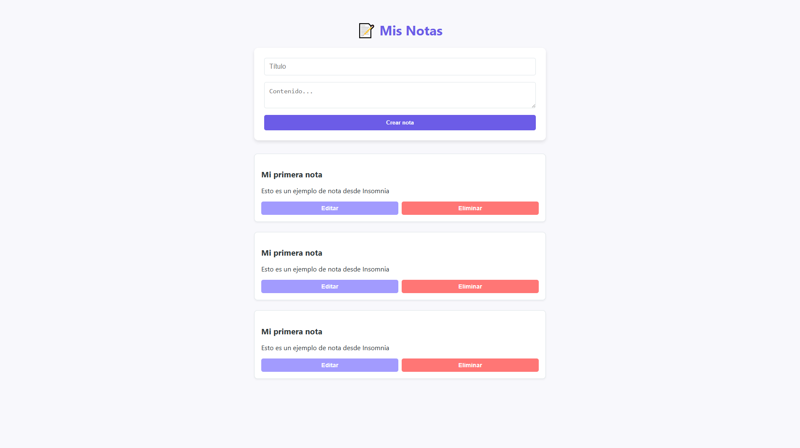
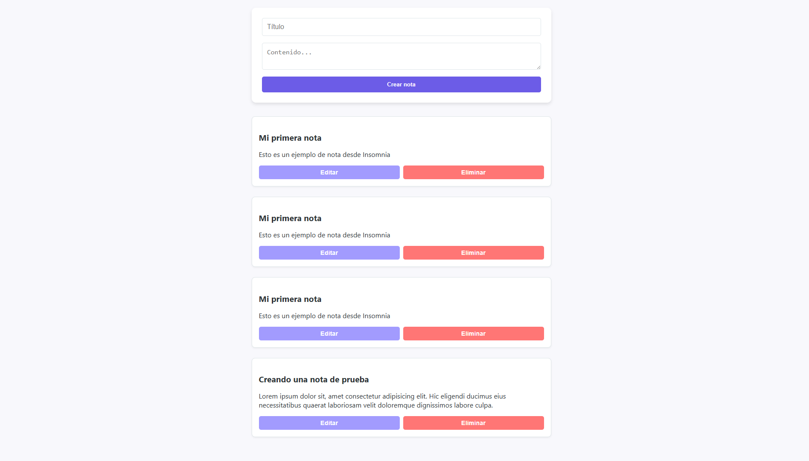
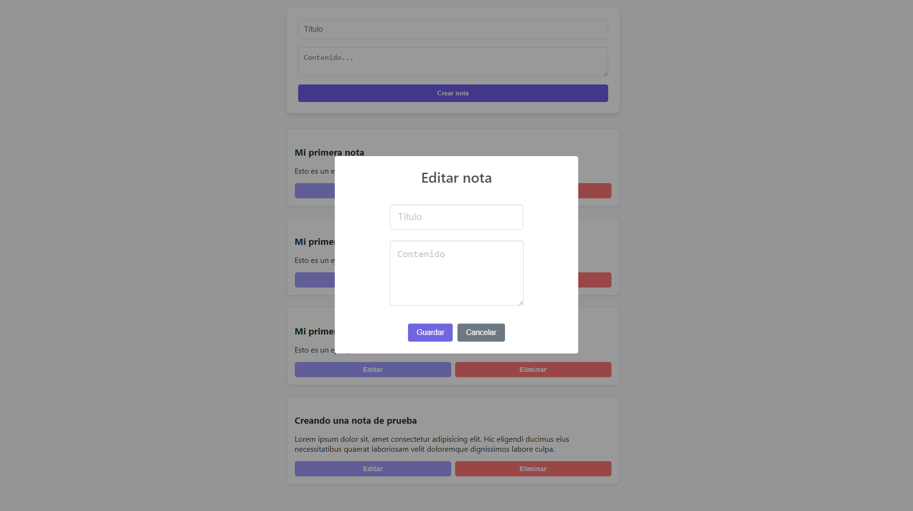
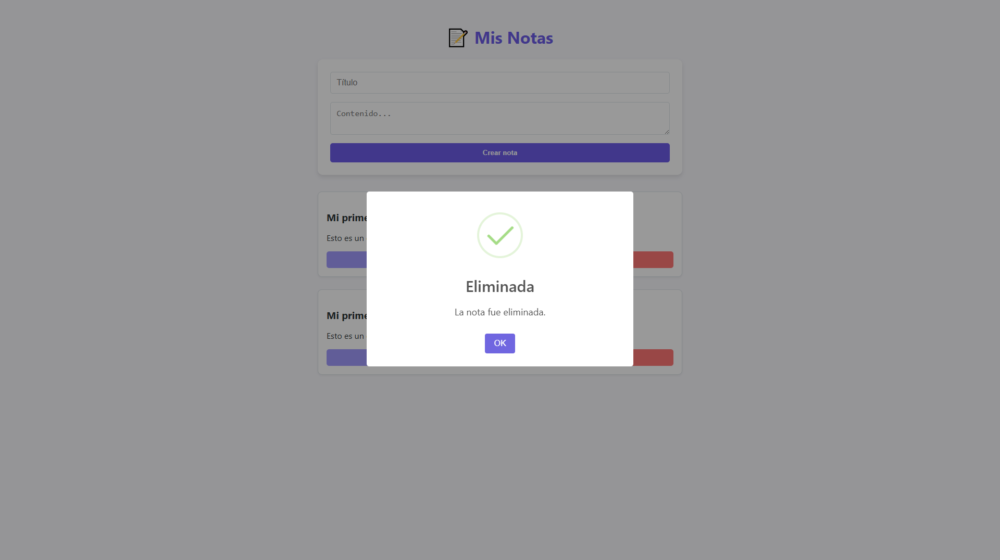
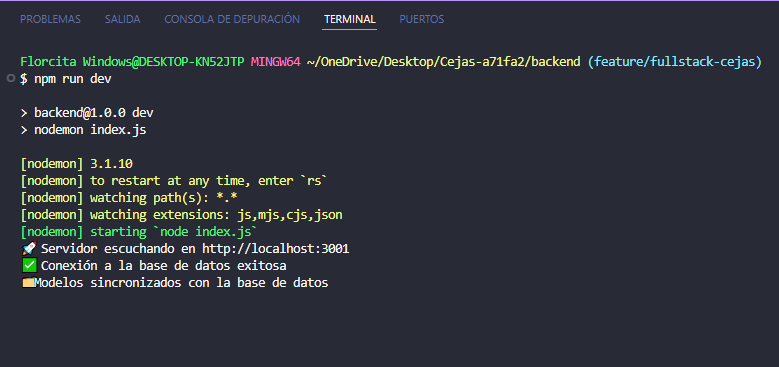
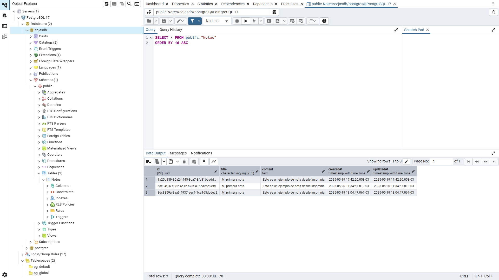

# Cejas - App de Notas

Este proyecto es una aplicación web de notas construida como parte del challenge técnico para Ensolvers. Permite crear, visualizar, editar y eliminar notas. El backend está desarrollado con Node.js, Express, Sequelize y PostgreSQL; el frontend está hecho con HTML, CSS y JavaScript puro (sin frameworks).

---

## 🚀 Cómo ejecutar el proyecto

1. **Clonar el repositorio**

```bash
git clone https://github.com/hirelens-challenges/Cejas-a71fa2.git
cd Cejas-a71fa2
```

2. **Configurar variables de entorno**

⚠️ Antes de ejecutar el `setup.sh`, recordá editar el archivo `.env.example`, renombrarlo como `.env` y completarlo con tus credenciales locales de base de datos:

```env
DB_NAME=nombre_de_tu_bd
DB_USER=tu_usuario
DB_PASSWORD=tu_password
DB_HOST=localhost
DB_PORT=5432
```

3. **Ejecutar el script de instalación (`setup.sh`)**

### 🛠️ Este proyecto incluye un script para automatizar el proceso de instalación del backend.

**Pasos para usarlo:**

⚠️ Antes de ejecutar el script, asegurate de crear el archivo `.env` a partir del archivo `.env.example` y completarlo con tus credenciales locales de base de datos:

```bash
cp .env.example .env
```

Asigná permisos de ejecución al script (solo la primera vez):

```bash
chmod +x setup.sh
```

Ejecutá el script:

```bash
./setup.sh
```

El script instalará las dependencias del backend, ejecutará index.js para sincronizar los modelos con tu base de datos PostgreSQL, y dejará el backend corriendo en http://localhost:3001.

---

## 📂 Estructura del proyecto

```bash
Cejas-a71fa2/
├── backend/
│   ├── config/
│   │   └── db.js
│   ├── controllers/
│   │   └── noteController.js
│   ├── middlewares/
│   │   └── errorHandler.js
│   ├── models/
│   │   └── Note.js
│   ├── node_modules/
│   ├── routes/
│   │   └── noteRoutes.js
│   ├── services/
│   │   └── noteService.js
│   └── index.js
│
├── frontend/
│   ├── assets/
│   │   └── (imágenes, íconos, etc.)
│   ├── scripts/
│   │   └── main.js
│   ├── styles/
│   │   └── styles.css
│   └── index.html
│
├── .env.example
├── setup.sh
└── README.md
```

---

## 🛠️ Tecnologías utilizadas

- **Backend:** Node.js, Express, Sequelize, PostgreSQL
- **Frontend:** HTML5, CSS3, JavaScript
- **Control de versiones:** Git

---

## ✨ Funcionalidades implementadas (Fase obligatoria)

- Crear notas
- Visualizar todas las notas
- Editar notas existentes
- Eliminar notas

Las notas se almacenan en una base de datos PostgreSQL mediante Sequelize ORM.

---

## 📸 Capturas de pantalla

A continuación se muestran algunas capturas del funcionamiento de la app:

### 🏠 Vista principal con notas cargadas



---

### ➕ Creación de una nueva nota

Formulario con título y contenido completado, listo para ser enviado.


---

### ✅ Nota creada correctamente

La nota aparece al final de la lista luego de enviarla.


---

### 📝 Edición de una nota existente

Prompt activo para modificar una nota seleccionada.


---

### ❌ Eliminación de una nota

Mensaje de confirmación antes de eliminar una nota.


---

### ⚙️ Backend corriendo en consola

El servidor Express está activo y sin errores en el puerto 3001.


---

### 💾 Base de datos funcionando

Vista de la tabla `Notes` en pgAdmin o herramienta similar.


---

## 🌐 Vista pública del proyecto

Podés ver una demo en vivo de la app en:

👉 [GitHub Pages - Cejas](https://hirelens-challenges.github.io/Cejas-a71fa2/)

---

## 📩 Contacto

Desarrollado por Florcita 💫 como parte del challenge técnico para Ensolvers.

[(LinkedIn)](https://www.linkedin.com/in/florencia-cejas)
